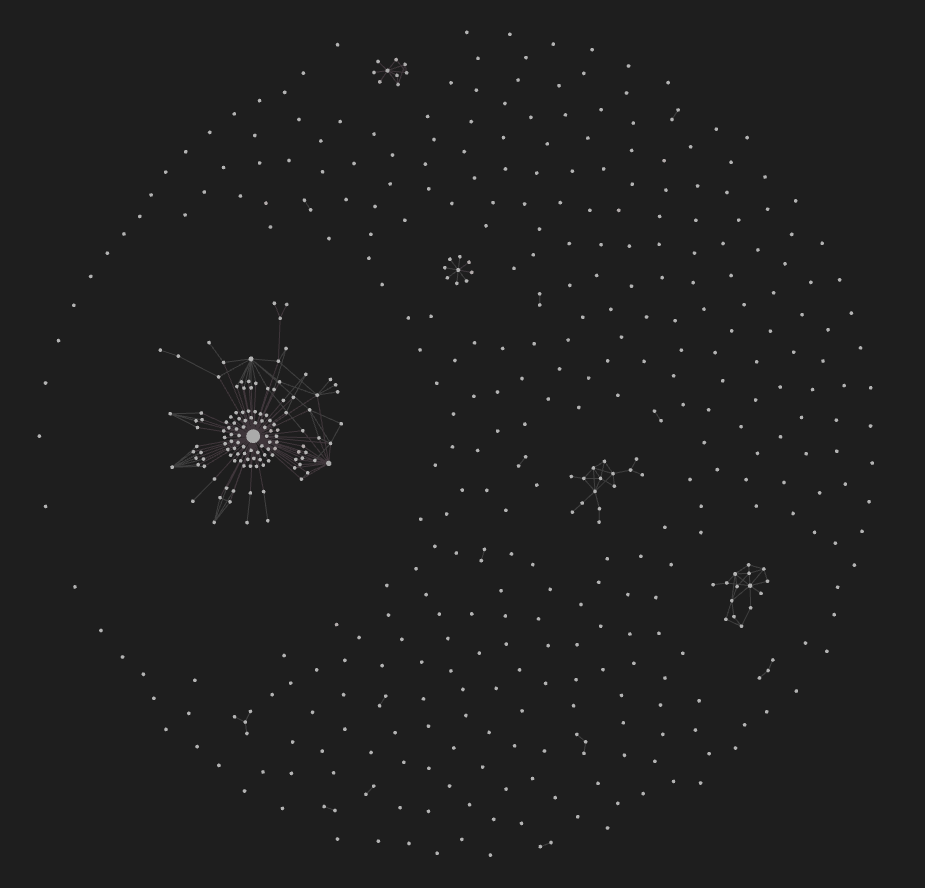
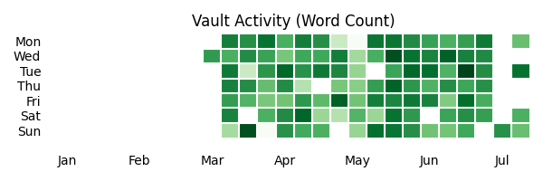
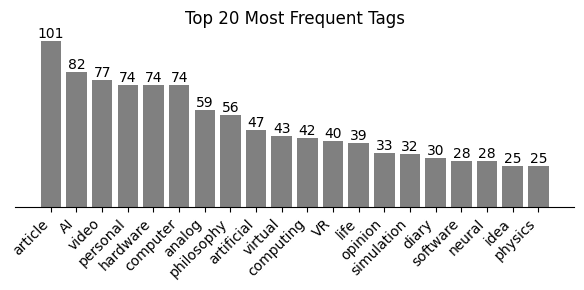

# Obsidian.ai

**Quickly organize your markdown notes in Obsidian.md using _**OpenAI**_’s large language models.** 

Any random, untagged, empty, or unlinked notes? No more. This little script will fill the gaps, connect what belongs together, and even create high level organizing nodes if a specific topic has a lot of notes. 

### 🧶 Organizes Your Notes
The script works through your entire vault, letting ChatGPT read and understand every note, remembering potential *tags* and *topics*, and linking and tagging up what belongs together so there are no more empty and lonely notes.

<!--
||  |
| :--: | :--: |
| **a.** My vault without tags or attachments before organizing it with obsidian.ai. | **b.** My vault after it was organized by obsidian.ai.
-->

### 🎨 Shows Meta-data of Your Vault
Print out statistics of your vault like how many notes you have, how many words, how many tags, which tags, and so on. The script also creates a GitHub-like activity timeline and a bar-chart of your most popular tags:

||  |
| :--: | :--: |
| **a.** Activity map. | **b.** Tag frequency.

---
### 🧠 How Does It Work?
1. **First Analysis.** Go through every note and save in a `.csv`-file:
   1. unique ID
   2. name
   3. date of creation
   4. number of words
   5. tags
   6. number of tags
   7. link names to other notes in the vault
   8. number of links
2. **Meta-Stats.**
   1. Count how often each tag is used. Create a tag frequency bar chart.
   2. Count how many words are written over time. Create a vault activity chart.

<!--
1. **Delete empty notes** from the vault and from the `.csv` if they have no link.
2. **Add tags to the tagless.** 
   1. List all the notes without tags.
   2. Go through each file and use GPT + the tag frequency data of the vault to add three tags based on the content that fit it the best.
3. **Connect lonely notes via referencing links.**
   1. List all the notes without any links to other notes.
   2. For every note in this list, list all other notes with the same tags.
      1. Sort these notes based on (number of links x number of words).
      2. Take the top 10 notes and show it + the current unlinked note to ChatGPT with the prompt: "Look at these two notes and evaluate if their content is closely related and should be referencing each other. Return one of the categories to define the strength of their relation: "Little", "Minor", "Strong".
      3. If there is a strong or minor relation, add the note ID and name to a list.
      4. After analyzing all 10 notes, add a: "Likely related notes:" section to the note with a list of links to new-found notes.
-->

---
### ❓ How to Use
1. Install `Python3` and `pip install matplotlib openai`.
2. Copy-paste the link to your vault's directory and optionally your OpenAI key into the script.
3. Run the script!

It is that easy.

---
**Give this repo a ⭐** and let me know right here if you have any ideas or reach out to me on **X** [@QuentinWach](https://twitter.com/QuentinWach).
