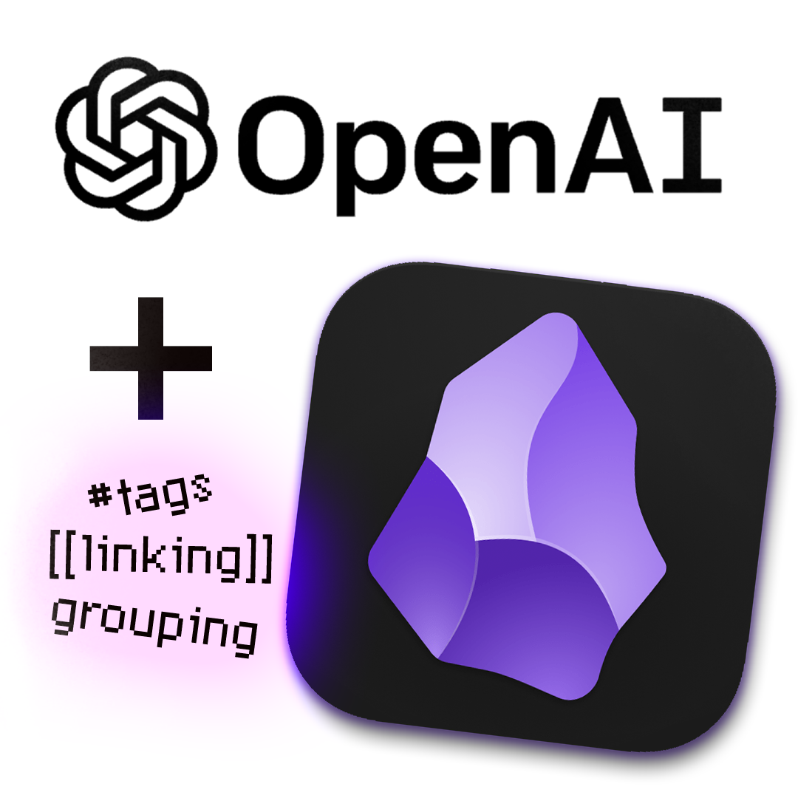

# Obsidian.ai

**Quickly organize your markdown notes in Obsidian.md using _**OpenAI**_’s large language models.** 

Any random, untagged, empty, or unlinked notes? No more. This little script will fill the gaps, connect what belongs together, and even create high level organizing nodes if a specific topic has a lot of notes. 

### 🧶 Organizes Your Notes
The script works through your entire vault, letting ChatGPT read and understand every note, remembering potential *tags* and *topics*, and linking and tagging up what belongs together so there are no more empty and lonely notes.

||  |
| :--: | :--: |
| **a.** My vault without tags or attachments before organizing it with obsidian.ai. | **b.** My vault after it was organized by obsidian.ai.

### 🎨 Show You Meta-data of Your Vault
Print out statistics of your vault like how many notes you have, how many words, how many tags, which tags, and so on. The script also creates a GitHub-like activity timeline and a bar-chart of your most popular tags:

||  |
| :--: | :--: |
| **a.** Activity map. | **b.** Tag frequency.

---
### How Does It Work?

---
### ❓ How to Use
1. Install `Python3` and `pip install matplotlib openai`.
2. Copy-paste the link to your vault's directory and optionally your OpenAI key into the script.
3. Run the script!

It is that easy.

---
> **Give this repo a ⭐** and let me know right here if you have any ideas or reach out to me on **X** [@QuentinWach](https://twitter.com/QuentinWach).
